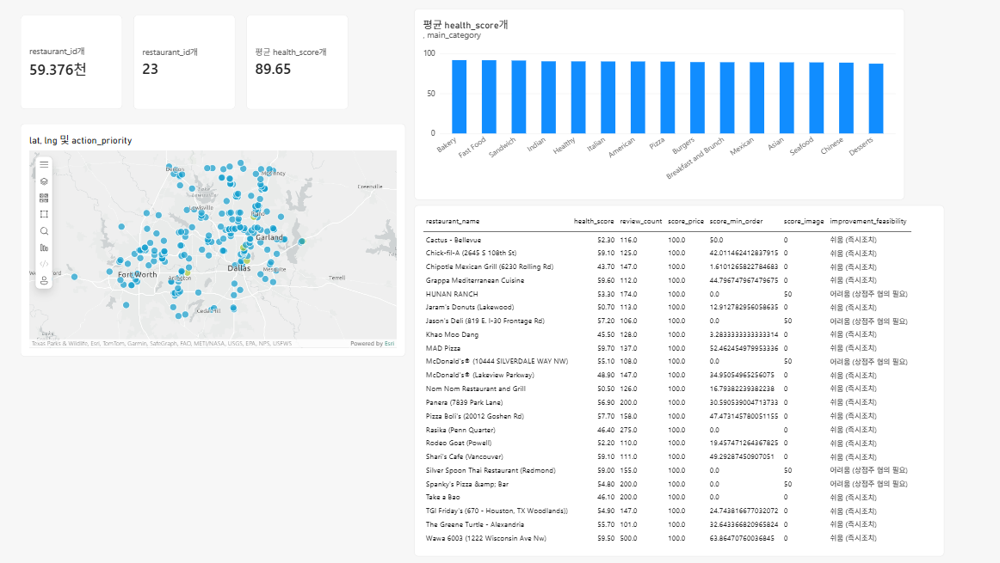
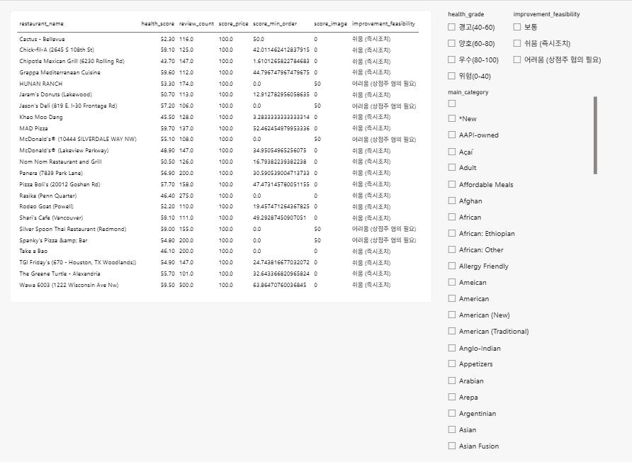
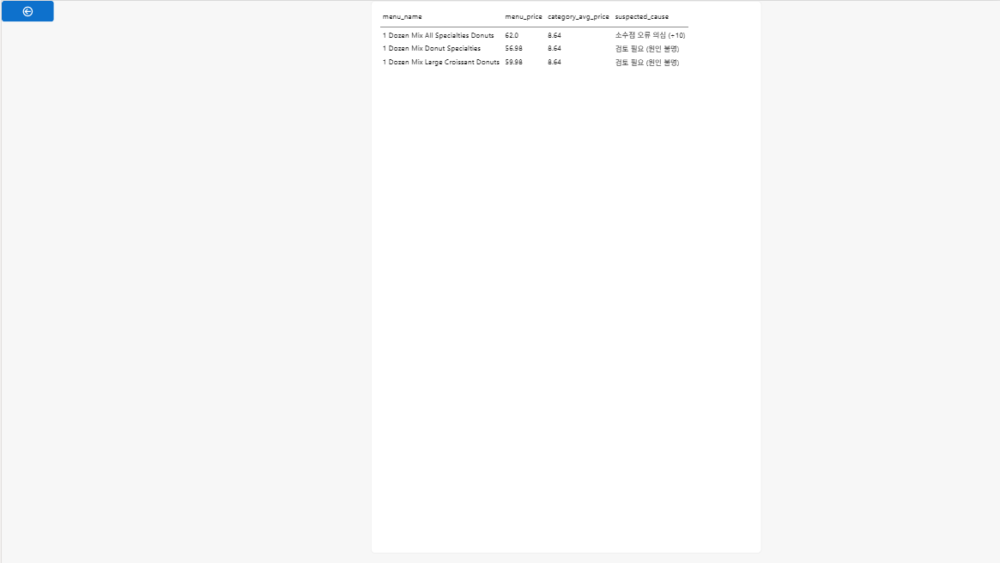

# 🚑 Catalog Triage
### SQL 기반 카탈로그 품질 이상탐지 & 비즈니스 영향도·운영 우선순위 분석

> 응급실에서 환자를 심각도에 따라 분류(Triage)하듯, 배달 플랫폼의 카탈로그 문제도 발견에서 끝나지 않고 **"무엇을 먼저 고쳐야 하는가"**까지 답하는 데이터 파이프라인입니다.

**핵심 질문**: 수많은 상점의 카탈로그 문제 중, 어떤 문제를 먼저 해결해야 비즈니스에 가장 큰 효과를 낼 수 있을까?

---

## 📌 프로젝트 개요

배달 플랫폼(쿠팡이츠 등)의 카탈로그 품질(가격, 최소주문금액, 이미지, 메뉴 정보 등)을 SQL 기반으로 분석하여 이상을 탐지하고, 비즈니스 영향도를 결합해 운영 우선순위(P1/P2/P3)를 도출하는 End-to-End 분석 파이프라인입니다.

```
이상 탐지 → 원인 분석 → Health Score 산출 → Business Impact 분석 → 우선순위 도출 → 대시보드
```

## 🛠 사용 기술

| 영역 | 기술 |
|---|---|
| 데이터 분석 | Python (Pandas, NumPy), SQL (DuckDB) |
| 이상탐지 | CTE, Window Function, Z-Score, 통계적 임계값 검증 |
| 시각화 | Power BI (ArcGIS Maps, 대시보드 3페이지) |
| 환경 | Google Colab |

## 📊 데이터 출처 및 한계

실제 배달 플랫폼 운영 데이터에 접근 권한이 없어, 공개 데이터셋 [Uber Eats USA Restaurants and Menus](https://www.kaggle.com/datasets/ahmedshahriarsakib/uber-eats-usa-restaurants-menus)(Kaggle, 상점 6.3만 개·메뉴 500만 건)를 기반으로 했습니다.

- **실제 데이터를 그대로 활용한 부분**: 메뉴 가격, 카테고리, 메뉴 설명 완전성(결측비율), 평점/리뷰수
- **투명하게 합성한 부분**: 최소주문금액, 이미지 등록 상태, 품절 관리 비율, 필수정보 누락 여부 — 원본 데이터셋에 해당 필드가 없어, 실제 메뉴가격 기반의 현실적인 로직으로 합성하고 코드에 명시했습니다.

Business Impact 분석은 인과관계가 아닌 **가상 시나리오 하의 상관관계 검증**으로 해석해야 하며, 실제 서비스라면 A/B 테스트나 이중차분법(DID) 등 인과추론 방법론이 추가로 필요합니다.

## 🔍 분석 과정

### 1. 데이터 정제
Uber Eats는 음식점 외 편의점·약국·주류·잡화 배달도 포함하고 있어, 비음식 카테고리(21개)를 식별해 제외했습니다 (63,469 → 59,521개 상점). 가격이 문자열(`"12.5 USD"`)로 저장되어 있어 숫자로 파싱했고, 이 과정에서 0원 메뉴 17만 건, 음수 가격 등 실제 데이터 품질 이슈를 확인했습니다.

### 2. Catalog Health Score 설계 (0~100점)
6개 KPI를 가중합산하여 상점별 품질 점수를 산출했습니다.

| KPI | 가중치 | 산출 방식 |
|---|---|---|
| 가격 정확성 | 30% | 카테고리별 Z-Score 이상치 비율 |
| 최소주문금액 정합성 | 25% | 상점 내 메인메뉴가 대비 배수(Internal Ratio) |
| 이미지 품질 | 25% | 등록 상태(정상/저해상도/없음) |
| 메뉴/옵션 완전성 | 10% | 메뉴 설명 결측비율 (실제 데이터) |
| 품절 관리 | 5% | 품절 메뉴 비율 |
| 필수정보 누락 | 5% | 상점명/주소/카테고리 결측 여부 |

### 3. SQL 이상탐지 및 오탐 검증
Z-Score만으로 가격 이상치를 탐지했을 때, 실제 정상 고가 상품(스테이크하우스, 와인 리스트 등)이 대거 오탐되는 것을 발견했습니다. 이를 해결하기 위해:
- 가격을 100·10으로 나눠 카테고리 평균과 비교해 "소수점 오류"를 원인별로 분류
- 신뢰도(High Confidence / Needs Review)로 등급을 나눠, 확신 있는 오류만 Health Score에 자동 반영
- 이 과정을 3차례 반복하며 실제 고가 브랜드(스테이크하우스 등)가 최종 결과에서 오탐되지 않을 때까지 검증

최소주문금액 이상탐지는 5%의 이상치를 의도적으로 주입한 뒤 SQL 탐지 로직의 재현율(Recall)을 검증했습니다 — 다만 이는 임계값을 정답 분포에 맞춰 보정한 결과이므로, 실제 미지 데이터에는 재검증이 필요하다는 한계를 명시합니다.

### 4. Business Impact 분석
Health Score와 평점/리뷰수의 상관관계는 미미했습니다 (r=0.02~0.10). 다만 10점 구간별 분석 결과, **80점 미만에서는 리뷰수가 점수와 무관하게 정체되다가 80점 이상에서 뚜렷하게 상승하는 임계점 패턴**을 발견했습니다. 억지로 "품질이 좋으면 성과가 좋다"는 결론으로 포장하지 않고, 있는 그대로의 패턴을 보고했습니다.

### 5. 우선순위 도출 (P1/P2/P3)
Severity(Health Grade) × Business Impact(리뷰수 상위 25%, 영향 범위) × 개선 가능성(즉시조치/협의필요)을 결합해 최종 우선순위를 산출했습니다.

| 우선순위 | 상점 수 | 정의 |
|---|---|---|
| P1 | 23개 | 품질 위험/경고 등급 + 고영향(리뷰수 상위 25%) |
| P2 | 1,095개 | 중간 우선순위 |
| P3 | 58,258개 | 낮은 우선순위 |

## 📈 대시보드 (Power BI)

| 페이지 | 구성 |
|---|---|
| 1. 요약 | KPI 카드, 상점 분포 지도(ArcGIS), 카테고리별 Health Score |
| 2. P1 상세 | 우선순위별 필터링 가능한 액션 리스트 |
| 3. 메뉴 상세 | 드릴스루로 상점별 가격 이상치 메뉴까지 확인 |





## 💡 핵심 성과 및 배운 점

- 단순 통계 규칙(Z-Score)만으로는 오탐이 많다는 것을 데이터로 직접 확인하고, 원인 분류·신뢰도 등급화를 통해 정밀도를 높였습니다.
- 데이터 합성이 필요한 상황에서, 임의의 값이 아닌 실제 비즈니스 로직(메인메뉴가 대비 배수)에 기반한 합성 설계를 시도했습니다.
- Business Impact 분석에서 예상과 다른 결과(약한 상관관계)가 나왔을 때, 결론을 왜곡하지 않고 있는 그대로 보고하며 대안적 해석(임계점 패턴)을 제시했습니다.

## 🔮 향후 개선 방향

- `main_category`가 대표 카테고리 1개만 추출된 구조적 한계로, 메뉴 단위 서브카테고리 분류가 있다면 오탐을 더 줄일 수 있습니다.
- 최소주문금액 탐지 로직은 실제 미지 데이터로 재검증이 필요합니다.
- 실제 주문 전환 로그가 있다면, Business Impact 분석에서 인과추론(A/B 테스트, DID) 적용이 가능합니다.

## 📁 파일 구조

```
├── Catalog_Health_Radar.ipynb      # 전체 분석 노트북 (Colab)
├── catalog_triage_dashboard.csv    # 대시보드용 상점 단위 데이터
├── price_outlier_details.csv       # 메뉴 단위 가격 이상치 상세
├── screenshots/                    # 대시보드 캡처
└── README.md
```

## 🔗 관련 프로젝트

이 프로젝트에서 발견한 이상치는 [Catalog AutoPilot](#) (Claude API 기반 자동 모니터링·리포팅 파이프라인) 프로젝트로 이어집니다.
